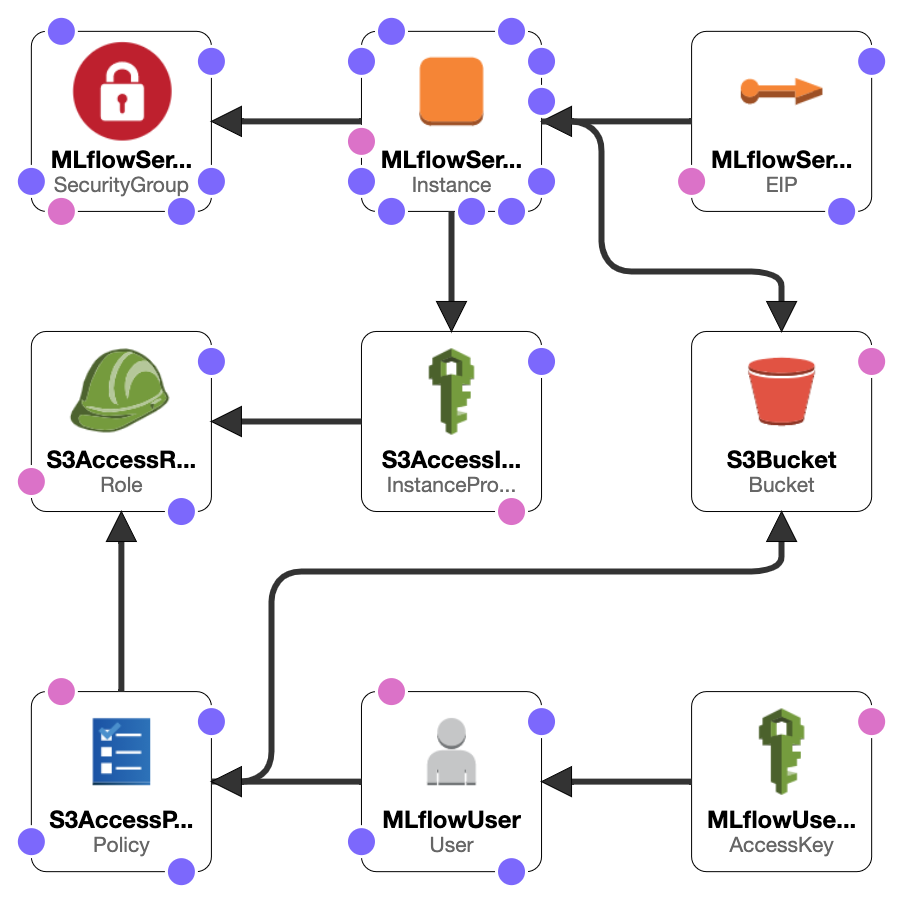

# ML Flows server

To ease the collaboration we are using a self-hosted ML-Flows experiment tracking server with S3 artifact storage.
Cloudformation template for AWS hosting takes care of creation of all the resources.
However, to access the EC2 instance a key-pair must be already created.

Install boto3
Setup AWS account (to push to Artifact Store)
(Profile)

AWS Named Profile:
https://docs.aws.amazon.com/cli/latest/userguide/cli-configure-profiles.html

`aws configure --profile smart-mirror-ml`

env AWS_PROFILE

EC2 init logs (for debugging) are available after SSH under:
cat /var/log/cloud-init-output.log

Error logs from mlflow:
journalctl -u mlflow

cd ai-mask-model/ml_ops
docker build -t smart-mirror-event-bus .

building:
docker build -t 573518775438.dkr.ecr.us-east-2.amazonaws.com/mlflow:latest .

pushing to ECR
aws ecr get-login-password \
              --region us-east-2 \
              --profile smart-mirror \
            | docker login \
              --username AWS \
              --password-stdin 573518775438.dkr.ecr.us-east-2.amazonaws.com

docker push 573518775438.dkr.ecr.us-east-2.amazonaws.com/mlflow

version 1.15.0 is broken:
https://github.com/mlflow/mlflow/issues/4208
